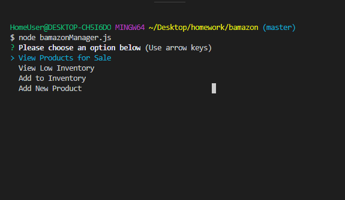
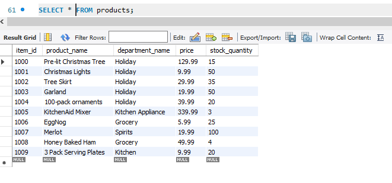

# Bamazon Marketplace

The Bamazon Marketplace is a command line application that uses MySQL to track products and inventory. There is a customer facing application as well as a manager application. 

Below is a picture of the starting table and inventory.

Below is what the customer will see when they begin the application. 

After it shows the avaiable products it will prompt the customer to select an item and quantity to purchase and will show the order total. It will then ask if they would like to purchase another item.

Below is the updated table after the customer purchased items 1002 and 1005.

If they select Yes, the prompts will return, if they select No a message will appear. 

If the inventory is out it will show the following message and ask the customer if they would like to purchase another item.

Next we will look at the manager interface, below is what the manager will see when they start the application. 

If they select the first option they will see all the products below. 

If they select the second option, they will see a report of low inventory. The report shows all items with stock less than 5. 

If the third option is selected, the manager will be able to add inventory to an existing item.

The table is also updated with the inventory adjustment.

If the forth option is chosen, the manager will be able to add a new item to inventory. It will prompt them with questions about the item. 

The table will update with the new item as well.

Below is a video of the application in action as well! 

[Link to Screencastify](https://drive.google.com/file/d/1EYO_XzL36t4qEfPJ9ZeRyGvHHj3FZZe3/view)
